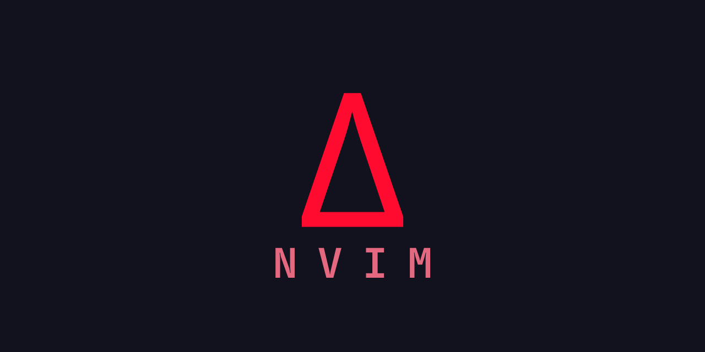

<div align="center">
  
  
  
</div>
<br>


<br>

<div align="center">
  
  
</div>
<br>

## Table

[Requirements](#requirements)<br>
[Usage](#usage)<br>
[Features](#features)<br>
[Errors](#errors)

## 🧠 Animation of a moving sine wave ∿👨‍💻 with Copilot enabled in DeltaNvim

<div align="center">

</div>


# Requirements:

- **Python>3**
- **PIP** to the latest version with 
    - **Windows:**
    ```python.exe -m pip install --upgrade pip```
    - **Linux(Ubuntu):**
    ```sudo apt install pip```
    - **Linux (Arch Linux)**
    ```sudo pacman -S python-pip```
- **Git**
- **Nodejs**, **Npm**
    - **Windows:** nodejs [website](https://nodejs.org/)
    - **Linux(Ubuntu):**
        ```sh
        sudo apt install curl
        curl -o- https://raw.githubusercontent.com/nvm-sh/nvm/v0.39.3/install.sh | bash
        source ~/.bashrc
        nvm list-remote
        nvm install v<LTSversion>
        nvm list
        nvim install lts/...
        nvm use v<LTSversion>
        ```
- **Deno**
    - **Windows:**
        - ```irm https://deno.land/install.ps1 | iex``` or check [Deno's Website](https://deno.com/) 
    - **Linux/Mac:**
        - ```curl -fsSL https://deno.land/install.sh | sh```

        - Crear archivo envexport: `touch /home/yourUser/.deno/envexport`
- **Neovim**
    - **Windows:**
        - In Windows Powershell **Install Chocolatey** (Do not install Chocolatey through the nodejs installer, but from the script on the web site)
        - As ADMINISTRATOR **Install Neovim** on Windows Powershell through [Chocolatey](https://github.com/neovim/neovim/blob/master/INSTALL.md#chocolatey)
    - **Linux(Ubuntu):**
        <a href="https://github.com/neovim/neovim-releases/releases">https://github.com/neovim/neovim-releases/releases</a>
    - **Linux (Arch Linux)**
        ```sudo pacman -S neovim```
# Usage

<details>
  <summary>🖥️ Windows</summary>

  - **Clone the repository** to the location ```AppData/Local/```
  - From the terminal, **go to the AppData/Local/DeltaNvim/ folder**
  - **Give permissions** to the install.ps1 file with ```Set-ExecutionPolicy Bypass -Scope Process -Force```, and **execute it** with ```.\install.ps1```
  - Restart the terminal

</details>

<details>
  <summary>💻 Linux</summary>

  - **Clone the repository** to the location ```.config/```
  - From the terminal, **go to the .config/DeltaNvim/ folder**
  - **Give permissions** to the install.sh file with ```chmod +x install.sh```, and **execute it** with ```./install```
  - Restart the terminal
  
  </details>

</details>

---

## Install additional config requirements

### Linux (Ubuntu/Debian)
- Install the Python venv module `sudo apt install python3.yourCurrentPythonVersion-venv`
- Create the virtual environment inside the DeltaNvim folder: `python3 -m venv env` 
- Activate the virtual environment `source env/bin/activate`
- Install additional requirements `pip install -r requirements.txt`

---

- In the windows terminal **enter DeltaNvim** using ```dnvim```
- To **find the configuration folder for DeltaNvim** type from neovim ```:echo stdpath('config')```
- **Recommended font:** In the fonts folder there is a set of JetBrains fonts, from File Explorer select all fonts and right click on install. Then from the windows console configuration (powershell or cmd) go to the Profiles section and select Defaults, then select Appearance, and in the Font face box select a JetBrains font (**JetBrainsMono Nerd Font Mono** as a personal recommendation) **This font allows the display of icons for both folders and file type, and also for special characters** that aesthetically improve the visualization of the code. And finally click on save.

# Features

- **Integrated terminal** with <kbd>Ctrl</kbd> + <kbd>j</kbd>
- **LSP server manager**, **DAP servers**, **linters** and **formatters** with ```:Mason```
- A **file explorer tree** with <kbd>Ctrl</kbd> + <kbd>b</kbd>
- **Quick and easy mappings** (👀 check lua/plugins/keymaps.lua file)
- **Quickly navigate** between functions, classes and methods **using the hierarchical file view** with <kbd>ts</kbd>
- Identification of problems in the code by **precise diagnostics** 🕵🏻‍♂️  with <kbd>tt</kbd>
- Available **code actions** 💡 press <kbd>space</kbd> + <kbd>as</kbd> to display the options (in this case the space key corresponds to the \<leader\> key) 
- Start or invoke **Github Copilot** with the command ```:Copilot setup```
    - Use the command ```:Copilot enable``` to enable the plugin
    - Use the command ```:Copilot disable``` to disable the plugin
    - Use <kbd>Tab</kbd> to accept the suggestions
- **Markdown preview** with ```:PeekOpen``` and ```:PeekClose``` (You can check 👀 the lua/plugins/peekdeltanvim.lua file if you want to modify the Live Server settings, such as the default browser for the preview and so on)
- **Support for KaTex** for mathematical formulas in Markdown files:
    ```
    $$
    E = mc^2
    $$
    ```
    $E = mc^2$
    
<!-- - **Live server for Markdown files** 📝 with ```:MarkdownPreview```
- **REPL interactive in DeltaNvim** 👨‍💻
    - windows (install wezterm terminal with Chocolatey in ADMIN modo ```choco install wezterm -y``` o desde su [sitio web](https://wezterm.org/))
    
    ### this configuration can be good for linux systems, because tmux is available on that operating system, so the default terminal would be tmux
    - With <kbd>ctrl</kbd> + <kbd>j</kbd> to enable the terminal
    - And then on the line of code or the code fragment, press <kbd>Ctrl + c</kbd> <kbd>Ctrl + c</kbd>
    - Enter ```julia``` in the terminal to start the REPL **if** the terminal failed to launch in the previous step
    - **(Note)** Check the lua/plugins/environment.lua file <u>if you prefer</u> to use a different terminal for REPL (specifically the vim.g.slime_target assignment) -> por defecto (wezterm para windows) -->


## Errors

<details>
<summary>Error executing Lua callback: Vim:E475: Invalid value for argument cmd: 'deno' is not executable</summary><br>

**Error completo:**

```sh
Error executing Lua callback: Vim:E475: Invalid value for argument cmd: 'deno' is not executable 
stack traceback:                                                                                                    
        [C]: in function 'jobstart'                                                                                 
        ...e/.local/share/DeltaNvim/lazy/peek.nvim/lua/peek/app.lua:53: in function 'init'                          
        .../.local/share/DeltaNvim/lazy/peek.nvim/lua/peek/init.lua:23: in function 'open'                          
        .../.local/share/DeltaNvim/lazy/peek.nvim/lua/peek/init.lua:113: in function <.../.local/share/DeltaNvim/lazy/peek.nvim/lua/peek/init.lua:104>
```

**¿Cuando ocurre?<br>**
Ocurre cuando se quiere inicar el server de markdown mediante el comando :PeekOpen. Por lo tanto el indicativo de ```'deno' is not executable ``` muestra que deno a pesar de estar instalado en el sistema, el sistema no lo reconoce.

**Solution:**<br>

1. Dirigirse a la ubicación del ejecutable mediante: ```cd ~/.deno/bin/```

2. Copiar el ejecutable a la ruta /usr/local/bin mediante: ```sudo cp -r deno /usr/local/bin/```

3. Cerrar/Reiniciar la terminal

</details>

<details>
<summary>Error: /home/yourUser/.deno/envexport: No such file or directory</summary><br>

**Solution:**<br>

1. Crear el archivo envexport mediante: ```touch /home/yourUser/.deno/envexport```

</details>

<details>
<summary>Error: Peek error: error: Module not found "file:///home/yourUser/.local/share/DeltaNvim
/lazy/peek.nvim/public/main.bundle.js".                                         
Press ENTER or type command to continue</summary><br>

**Solution:***<br>

1. Dirigirse al directorio peek.nvim mediante: ```cd ~/.local/share/DeltaNvim/lazy/peek.nvim```

2. Dentro del directorio peek.nvim ejecutar el siguiente comando: ```deno task --quiet build:fast```

3. Reinstalar peek ingresando a DeltaNvim mediante el comando ```dnvim``` en la terminal mediante el comando ```:Lazy```
